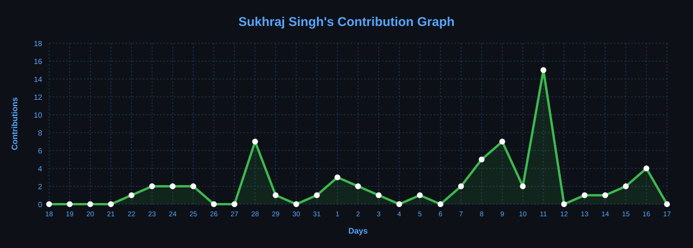

<h1 align="center">Hi, I'm Sukhraj Singh 👋</h1>

<h3 align="center">
B.Tech CSE Student • Full Stack Developer • AI/ML Enthusiast
</h3>

<p align="center">
  <a href="https://github.com/Sukhraj-Singh-2006">
    
  </a>
  <a href="https://github.com/Sukhraj-Singh-2006?tab=followers">
    
  </a>
</p>

<p align="center">
  <a href="https://www.linkedin.com/in/sukhraj-singh-975397248/">
    
  </a>
  <a href="mailto:24BCS10040@cuchd.in">
    
  </a>
  <a href="https://www.instagram.com/its_sukhraj06/">
    
  </a>
</p>

---

## About Me

I'm a Computer Science Engineering student passionate about building **full-stack applications, intelligent systems, and practical software solutions**.

My primary interests include:

* Full Stack Web Development
* Artificial Intelligence & Machine Learning
* Software Engineering
* Backend Development & APIs
* Database Design
* System Design & Deployment

I enjoy taking an idea from **concept → development → deployment** and turning it into a usable product.

---

## What I'm Working On

* Building production-oriented full-stack applications
* Exploring AI/ML applications in real-world problems
* Improving backend architecture and API design
* Learning scalable system design and deployment
* Contributing to open-source projects

---

## Technical Skills

### Languages

<p>
  
</p>

### Frontend

<p>
  
</p>

### Backend & APIs

<p>
  
</p>

### Databases

<p>
  
</p>

### AI / Machine Learning

<p>
  
</p>

### Tools & Deployment

<p>
  
</p>

---

## Featured Projects

### 🧠 AI-Powered Bone Fracture Detection

Deep learning system for **multiclass bone fracture classification** using computer vision and transformer-based models.

**Tech:** Python • PyTorch • Vision Transformer • OpenCV • Machine Learning

---

### 📋 Form & Finance Management System

A full-stack workflow management system developed for **IIT Ropar's Centre of Excellence in Socio-Environmental Sustainability for River Sand Mining (CoE-SEnSRS)**.

Features include:

* Digital form submission
* Role-based access control
* Automated approval workflows
* Digital signatures
* Finance management
* PDF generation and processing
* Database-backed workflow tracking

**Tech:** React • Node.js • Express.js • Supabase • PostgreSQL • PDF-Lib

---

### 📊 Smart Attendance Management System

A web-based attendance platform with separate interfaces for students, teachers, and administrators.

Features include:

* Attendance management
* Student & teacher dashboards
* Low-attendance detection
* PDF report generation
* OTP-based password recovery
* AI chatbot integration
* Face-recognition authentication

**Tech:** Python • Flask • SQLite • OpenCV • Face Recognition

---

### 🧭 Pathfinder

An interactive web application for exploring and discovering locations using map-based technologies and external APIs.

**Tech:** React • JavaScript • Leaflet.js • OpenStreetMap • Overpass API

---

## 📈 Contribution Activity

<p align="center">
  
</p>

---

## GitHub Statistics

<p align="center">
  
  
</p>

---

## Current Learning

```text
Advanced React        ███████████████░░░░░
Node.js & Backend     ███████████████░░░░░
System Design         ███████████░░░░░░░░░
Cloud & Deployment    ████████████░░░░░░░░
AI / ML               ███████████████░░░░░
```

---

## Let's Connect

I'm always interested in:

* Building interesting software
* Collaborating on AI/ML projects
* Full-stack development
* Open-source contributions
* Learning and sharing with other developers

<p align="center">
  <a href="https://www.linkedin.com/in/sukhraj-singh-975397248/">LinkedIn</a>
  •
  <a href="https://github.com/Sukhraj-Singh-2006">GitHub</a>
  •
  <a href="mailto:24BCS10040@cuchd.in">Email</a>
</p>

<p align="center">
  <b>Build. Learn. Improve. Repeat.</b>
</p>
